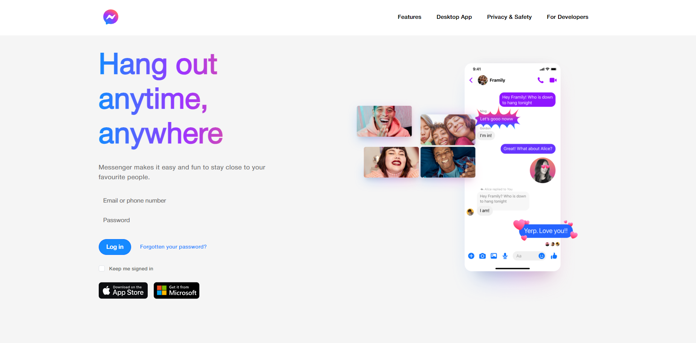

<a id="readme-top"></a>

<!-- PROJECT LOGO -->
<br />
<div align="center">
  <a href="[https://github.com/othneildrew/Best-README-Template](https://github.com/Dr0pyyyy/MessengerCopy)">
    
  </a>

  <h3 align="center">MessengerCopy</h3>

  <p align="center">
    Project to showcase my skills in web app development.
    <br />
    <br />
  </p>
</div>


<!-- TABLE OF CONTENTS -->
<details>
  <summary>Table of Contents</summary>
  <ol>
    <li>
      <a href="#about-the-project">About The Project</a>
      <ul>
        <li><a href="#built-with">Built With</a></li>
      </ul>
    </li>
    <li>
      <a href="#getting-started">Getting Started</a>
      <ul>
        <li><a href="#prerequisites">Prerequisites</a></li>
        <li><a href="#installation">Installation</a></li>
      </ul>
    </li>
    <li><a href="#contact">Contact</a></li>
  </ol>
</details>


<!-- ABOUT THE PROJECT -->
## About The Project



This project is for showcase purposes only. It is not fully working Messenger app with all the features.

What this project should represent:
* The biggest reason to start this project was to try to create chat app and learn SignalR deeply.
* It also shows my skills in C#, Angular and other languages and technologies
* It is NOT fully responsive because it is NOT based on showing my frontend and design skills. 

I'm sure it contains a lot of mistakes and unclean code. It is my first bigger project, so I would be really happy If you would have any improvement ideas to contact me.

<p align="right">(<a href="#readme-top">back to top</a>)</p>


### Built With
* [](https://skillicons.dev)
* [](https://skillicons.dev)
* [](https://skillicons.dev)
* [](https://skillicons.dev)
* [](https://skillicons.dev)
* [](https://skillicons.dev)
* [](https://skillicons.dev)

<p align="right">(<a href="#readme-top">back to top</a>)</p>


<!-- GETTING STARTED -->
## Getting Started

To get a local copy up and running follow these simple example steps.

### Prerequisites

Starting by installing NPM
* npm
  ```sh
  npm install npm@latest -g
  ```

### Installation

1. Clone the repo
   ```sh
   git clone https://github.com/Dr0pyyyy/MessengerCopy
   ```
2. Create .env file and inside add yout JWT secret
   ```sh
   JWT_SECRET_KEY=your-key
   ```
3. Install NPM packages
   ```sh
   npm install
   ```
4. Run angular app
   ```js
   ng serve
   ```
5. Run backend using build&debug button or by running command
   ```sh
   dotnet run
   ```

<p align="right">(<a href="#readme-top">back to top</a>)</p>


<!-- CONTACT -->
## Contact

Email - adamkoutny12345@seznam.cz
LinkedIn - https://www.linkedin.com/in/adam-koutný-8b6abb278

Project Link: https://github.com/Dr0pyyyy/MessengerCopy

<p align="right">(<a href="#readme-top">back to top</a>)</p>
